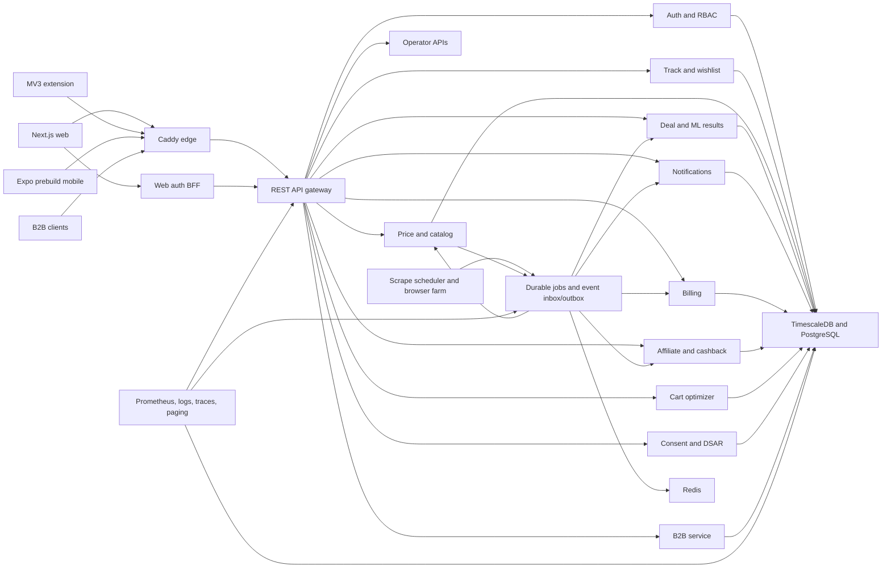

# Shopass production completion and release plan

## A. Audit baseline

### 1. Summary and release verdict

Release status: blocked.

The repository contains substantial local code, but the current product is a Vietnamese Shopee web beta. The advertised extension, TikTok and Lazada support, native mobile app, billing, affiliate, cashback, B2B, compliance operations, and several core shopper flows are disconnected or incomplete.

Current evidence:

- All 91 canonical task specs report `done`, while the separate improvement backlog has 16 `todo`, 5 `needs_stephen`, 1 `blocked`, and 18 `done`. Task truth must be reconciled before execution.
- On July 28, 2026, `https://shopass.cyberskill.world` resolved but returned HTTP 502. `api.shopass.cyberskill.world` had no DNS record.
- Web tests passed 38 suites and 94 tests. Extension tests passed 37 suites and 102 tests. Mobile logic passed 9 suites and 23 tests. BFF passed 11 tests. These are local and largely mock-backed.
- The DB migration test failed while starting TimescaleDB. ML test collection lacked `psycopg2`. The scraper farm lacked its local Jest binary. Web lint uses an invalid Next.js 16 command.
- At least 50 release-sensitive database tests can skip when their database is unavailable.
- No tracked file remains changed by this audit. The pre-existing untracked `.claude/` directory remains untouched.

Key code evidence includes the [gateway route allowlist](/Users/stephencheng/Projects/CyberSkill/shopass/services/gateway/internal/gw/router.go:76), [production service list](/Users/stephencheng/Projects/CyberSkill/shopass/deploy/docker-compose.production.yml:84), [extension auth stub](/Users/stephencheng/Projects/CyberSkill/shopass/extension/src/sync/auth-bridge.ts:22), [mobile scaffold statement](/Users/stephencheng/Projects/CyberSkill/shopass/apps/mobile/README.md:1), [unprotected breach handlers](/Users/stephencheng/Projects/CyberSkill/shopass/services/comply/internal/api/breach.go:19), [sandbox payment adapter](/Users/stephencheng/Projects/CyberSkill/shopass/services/bill/internal/pay/sandbox.go:16), and [non-atomic migration runner](/Users/stephencheng/Projects/CyberSkill/shopass/deploy/migrate.sh:53).

A flow may be called complete only when these five fields are green: implementation, automated evidence, staging evidence, production-safe evidence, and recovery evidence.

### 2. Current and target architecture

Target decisions:

- REST is the canonical production interface. The unused GraphQL BFF stays disabled in production unless a real client and complete contract tests justify it.
- Caddy exposes only the web app and gateway. Services remain private.
- External identity, role, organization, service, and tier headers are stripped. The gateway derives trusted context.
- Stubs and noop providers fail startup, report a disabled channel, or leave work pending. They never report delivery, settlement, or payout success.
- All asynchronous side effects use durable inbox, outbox, lease, retry, and reconciliation state.

### 3. User-role and permission matrix

| Role | Allowed behavior | Required controls |
|---|---|---|
| Anonymous visitor | Marketing pages, legal pages, sale calendar, known-product fake-sale lookup, waitlist, install links | Rate limits, no anonymous scrape creation, no private data |
| Unverified account | Verify email, resend verification, recovery, logout | No tracking, billing, referrals, or data sharing before verification |
| Verified free shopper | Track, chart, fake-sale check, compare, wishlist up to 20 items, push and email alerts | Own-data checks, verified channels, consent |
| Premium Basic | Free features, 100 wishlist items, bottom prediction | Current billing entitlement checked server-side |
| Premium Plus | Free features, 500 wishlist items, bottom prediction, SMS alerts | Current billing entitlement and channel quota |
| Premium Pro | Unlimited wishlist, bottom prediction, priority support | Current billing entitlement |
| Referral participant | Immutable attribution and reward status | Email verification, first successful track, 30-day fraud hold |
| Affiliate and cashback user | User-initiated link, balance, payout status | Disclosure, network-confirmed commission, beneficiary verification |
| Extension device | Consent, capture, sync, cart reading, user-triggered actions | Short-lived device token, least host permissions, central consent evidence |
| Mobile device | Native auth, tracking, alerts, checkout assistance, push, deep links | Keychain storage, PKCE, device revocation |
| B2B organization owner | Invite members, manage subscription and keys, reports and exports | Approved organization and audit log |
| B2B member | Entitled reports and seller views | Membership-derived organization context |
| B2B API client | Anonymized trend API only | Hashed key, quota, rapid revocation |
| Support operator | Customer cases and safe account assistance | Scoped, audited, no finance or breach authority |
| Finance operator | Payment, refund, invoice, reconciliation, payout review | Dual approval for money movement |
| Compliance operator | Consent, DSAR, legal holds, breach workflow | Append-only actor evidence |
| Data operator | Scrape, canonical matching, backfill, model operations | No customer-account mutation |
| System administrator | Configuration and emergency feature shutdown | Break-glass access, reason, expiry, audit |
| Production verifier | Synthetic PVT accounts and records only | Exact fixture manifest and cleanup rights |

### 4. End-to-end flow catalog

| Flow IDs | Intended flow | Current state | Primary completion tasks |
|---|---|---|---|
| F01-F03 | Landing, SEO, legal, blog, sale tools, waitlist, install | Local pages exist; production is down; install points to GitHub | T23, T24, T29, T34 |
| F04-F05 | Register, verify, login, Google linking, refresh, logout, recovery, profile, sessions, deletion | Partial; verification and account lifecycle routes are missing | T08, T23, T28 |
| F06-F08 | Onboarding, first track, first scrape, capture, history, chart | Partial; priming queue is noop and production proof is absent | T12-T14, T23 |
| F09-F10 | Wishlist and cross-platform comparison | Backend pieces exist, but gateway and client contracts disagree | T03, T12, T23 |
| F11-F12 | Create alert, evaluate every rule, honor channels, deliver, show history | CRUD exists; normal evaluation is unwired and bottom history is split | T16, T17 |
| F13 | Cart capture, optimizer, vouchers, code testing, coins | Backend-only or placeholder; no production route | T18, T24, T25 |
| F14-F15 | Premium checkout, return, entitlement, renewal, cancellation, invoice, refund | Sandbox-shaped checkout; remaining lifecycle is missing | T19, T23, T27 |
| F16 | Referral attribution and reward | Attribution exists; durable reward lifecycle is missing | T20 |
| F17-F18 | Affiliate link, conversion, cashback, beneficiary, payout | Unreachable; payout stub can falsely mark entries paid | T21, T22 |
| F19-F21 | Extension install, consent, auth, sync, cart/voucher actions, health, affiliate action | Consent is local; sync routes and JWT refresh are absent; actions are mocked | T24 |
| F22 | Native Android and iOS app, auth, track, chart, alert, push, cart, share | Logic-only scaffold with incompatible API contracts | T25 |
| F23 | B2B organization, trend reports, export, seller position, API keys | Packages exist without a runnable service, tenant model, gateway, or portal | T09, T26 |
| F24 | Consent center, access, portability, rectification, erasure | Backend is partial; UI, complete inventory, secure export, and saga are missing | T28 |
| F25 | Support, finance, compliance, fraud, and data operations | Operator roles and portal are missing; breach actions are unsafe | T09, T27, T28 |
| F26 | Shopee, TikTok, and Lazada collection with proxy, CAPTCHA, drift, retry | Partial and mock-backed; CAPTCHA handling is simulated | T13 |
| F27 | Product canonicalization, price ingest, backfill, retention, shared captures | Partial; live scale and consent path are unverified | T14 |
| F28 | Train, evaluate, publish, serve, and fall back for bottom prediction | Model artifact publication is a stub | T15 |
| F29 | Push, APNs, email, and SMS delivery | Missing providers can be marked sent; worker claim path is unsafe | T17 |
| F30 | Payment event inbox, settlement, renewal, refund, and reconciliation | Non-atomic and incomplete | T19 |
| F31 | Affiliate postback, fraud hold, reversal, payout reconciliation | Missing network wiring and unsafe concurrency | T21, T22 |
| F32 | Breach record, transitions, notices, evidence, and closure | Any customer JWT can mutate incidents | T09, T28 |
| F33 | Vietnamese and SEA locales, responsive behavior, accessibility, offline recovery, analytics | Vietnamese web subset only; analytics is a local event buffer | T29 |
| F34 | Build, deploy, observe, back up, restore, roll back, and verify | Manual local-image deployment; no restore proof or valid production smoke suite | T05-T07, T11, T31-T35 |

### 5. Prioritized gap register

| Gap | Severity | Root cause and impact | Required correction |
|---|---|---|---|
| G01 Live web 502 and missing API DNS | P0 | Public product is unavailable | T04, T33, T34 |
| G02 Customer-accessible breach mutation | P0 | No RBAC or actor policy | T00, T09, T28 |
| G03 Noop financial and delivery success | P0 | Production constructors accept stubs | T00, T17, T19, T22 |
| G04 Shared DB credential and no repository grants | P0 | Service isolation relies only on code | T05 |
| G05 Non-atomic migration and destructive orphan cleanup | P0 | Two ledgers and unsafe runner | T05, T06 |
| G06 Client and gateway contract conflicts | P0 | No route registry or generated contract check | T03 |
| G07 Incomplete identity lifecycle | P0 | Phone and email contracts conflict; erased accounts can refresh | T08 |
| G08 Payment settlement can acknowledge incomplete entitlement | P0 | Missing event inbox, transactions, and reconciliation | T19 |
| G09 Stub payout can mark money paid | P0 | External call precedes claimed durable state | T22 |
| G10 Core alerts do not execute end to end | P0 | Evaluator and notification handoff are unwired | T16, T17 |
| G11 No tested backup, restore, or rollback | P0 | Manual dump guidance only | T06, T34 |
| G12 Wishlist, compare, cart, affiliate, B2B, and extension routes are unpublished | P1 | Production allowlist covers a beta subset | T03, T12, T18, T21, T24, T26 |
| G13 Mobile is not a native product | P1 | Scaffold lacks React Native runtime and store builds | T25 |
| G14 Scraping and ML include simulations | P1 | Live providers, browser farm, and model gate are unfinished | T13-T15 |
| G15 DSAR and erasure omit material stores | P1 | Data inventory and cross-service orchestration are incomplete | T28 |
| G16 Required integration tests skip | P1 | CI does not provision every database contract | T31 |
| G17 Build, lint, supply-chain, and extension release gates are incomplete | P1 | Gate inventory omits packages and artifact proof | T31 |
| G18 Health, metrics, tracing, paging, and provider alerts are incomplete | P1 | Observability is mostly a local overlay | T11 |
| G19 Staging is not production-equivalent | P1 | It excludes major services and providers | T33 |
| G20 Task records contradict code and live evidence | P1 | One-dimensional `done` status hides release proof | T01 |

## B. Target implementation

### 6. Public interfaces, contracts, and data changes

The implementation will publish one reviewed OpenAPI contract and generate client types for web, extension, mobile, and B2B consumers.

Core rules:

- Web authentication continues through same-origin `/api/auth/*` handlers using Secure, HttpOnly cookies.
- Mobile and extension use gateway `/v1/auth/*` endpoints with PKCE, short-lived access tokens, rotating refresh families, and device revocation.
- Registration returns `202 {user_id, verification_required:true}`. Tokens are issued only after email verification.
- Billing remains the entitlement source of truth. JWT tier is advisory. Paid and sensitive operations check current entitlement.
- External `X-User-Id`, `X-B2B-Org-Id`, role, service, and tier headers are removed.
- Every mutation accepts a request ID; financial, payout, webhook, and job mutations also require an idempotency key.
- Errors use `{error:{code,message,request_id,details?}}`, with no secrets or internal SQL text.
- JSON uses snake_case at the API boundary. Generated clients perform no manual field translation.

Required route families:

| Route family | Auth policy | Owner |
|---|---|---|
| `/v1/auth/register`, verification, login, refresh, logout, recovery, OAuth | Public or session-specific rate limits | Auth |
| `/v1/me`, sessions, preferences, consent, deletion | Verified customer | Auth and comply |
| `/v1/tracked-products`, `/v1/products/*`, `/v1/wishlists`, `/v1/alerts` | Verified customer and owner checks | Track, price, deal |
| `/v1/cart/*`, `/v1/devices`, `/v1/notifications/*` | Verified customer | Cart and notif |
| `/v1/ext/sync`, `/v1/ext/ws` | Extension device grant | Gateway and track |
| `/v1/billing/*`, `/v1/referrals/*` | Verified customer, current entitlement where needed | Bill |
| `/v1/affiliate/*`, `/v1/cashback/*` | Verified customer | Affil |
| `/v1/comply/*` | Self-service or named compliance permission | Comply |
| `/v1/b2b/*` | Organization membership | B2B |
| `/public/v1/trends` | B2B API key | B2B |
| `/v1/admin/*` | Named operator permission | Operator services |
| `/internal/v1/*` | Audience-bound service identity | Private services |

Schema changes use expand-contract migrations and add:

- Organizations, memberships, invitations, role bindings, API-key ownership, and append-only audit events.
- Payment intents, provider events, immutable accounting entries, subscription events, refunds, invoices, and reconciliation checkpoints.
- Inbox events, outbox events, job leases, dedupe keys, attempts, and dead-letter records.
- Verified notification addresses, multiple devices, provider delivery IDs, and address-specific invalidation.
- Beneficiaries, payout batches, transfer attempts, settlement evidence, disputes, and clawbacks.
- DSAR cases, saga steps, per-store receipts, legal holds, export packages, and residue checks.
- Fixture runs and exact ownership labels for non-production test environments and production verification records.

Primary event contracts include:

- `price_snapshot.accepted -> alert.evaluate`
- `alert.fired -> notification.enqueue`
- `payment.provider_event_received -> payment.reconcile`
- `payment.settled -> entitlement.apply`
- `referral.qualified -> referral.reward_hold`
- `affiliate.conversion_changed -> cashback.reconcile`
- `payout.transfer_changed -> payout.reconcile`
- `dsar.step_completed -> dsar.resume`

### 7. Execution backlog

Every task must include its code and schema scope, tests, metrics, dashboards, deployment behavior, rollback or cleanup, and evidence links. Each becomes an audited CyberOS task in the single canonical backlog and passes both HITL gates.

| ID | Scope and acceptance | Dependencies | Estimate |
|---|---|---:|---:|
| T00 | Add fail-closed production containment. Disable breach mutations, stub payments, affiliate postbacks, cashback payouts, false-sent notification providers, B2B, direct mobile auth, and extension sync until their gates pass. Route-policy and configuration tests must prove closure. | None | 1-2 ew |
| T01 | Reconcile all task specs, coverage files, the improvement backlog, and ledgers. Track implementation, automated evidence, staging evidence, production evidence, and external blockers separately. | T00 | 1-2 ew |
| T02 | Record the locked product decisions below and obtain finance, counsel, provider, country, and store approvals. Any missing approval leaves its feature flag closed. | T00 | 2-3 ew plus external lead time |
| T03 | Build the OpenAPI route registry, generated clients, route-policy tests, and contract-drift gate. Remove every intentional 404 and DTO mismatch for approved flows. | T01, T02 | 2-4 ew |
| T04 | Define feature flags, environment contracts, domain ownership, required secret/provider modes, and truthful UI availability. Repair DNS and the 502 only during authorized execution. | T00-T03 | 2-3 ew |
| T05 | Replace the two migration ledgers with one checksummed, advisory-locked runner. Add per-service DB roles and grants, selected RLS defense for user and organization tables, fresh-install and upgrade tests, and a safe preflight for migration 0028. | T02, T03 | 5-7 ew |
| T06 | Implement encrypted off-host backups, WAL archiving, weekly base backups, restore automation, residue checks, and quarterly drills. Target RPO <= 5 minutes and RTO <= 1 hour. | T05 | 3-5 ew |
| T07 | Adopt the repository secret-provider module across services, use mounted secret files, support key overlap and rotation, scan history and artifacts, and prevent secret output in logs or process metadata. | T04, T05 | 3-5 ew |
| T08 | Complete verified-email registration, Google linking, login, refresh, logout, recovery, session/device management, profile, password change, suspension, deletion, and web/mobile/extension contracts. Refresh must reject suspended, erased, or version-revoked users. | T03, T05, T07 | 6-8 ew |
| T09 | Add RBAC, organizations, memberships, invitations, trusted gateway context, operator permissions, API-key ownership, and append-only actor audit. Cross-user, cross-org, forged-header, revoked-role, and break-glass tests must deny correctly. | T05, T08 | 5-7 ew |
| T10 | Add shared inbox/outbox, lease, retry, dedupe, dead-letter, and replay tools. No provider call may be held inside a DB transaction. Crash-boundary tests must prove at-most-once business effects. | T05, T07 | 4-6 ew |
| T11 | Wire `/livez`, dependency-aware `/readyz`, metrics, traces, structured redacted logs, external synthetics, real paging, service dashboards, provider health, queue lag, billing, payout, scrape, DB, disk, and backup alerts. | T04, T07, T10 | 4-6 ew |
| T12 | Align tracking, product history, chart, wishlist, comparison, ownership, tier limits, first-track behavior, and all web/mobile contracts. First tracking must enqueue a real priming job and return an observable pending state. | T03, T05, T08, T10 | 6-8 ew |
| T13 | Finish the Shopee, TikTok, and Lazada scheduler, browser farm, proxy policy, legal rate controls, CAPTCHA quarantine or approved provider, DOM-drift detection, retries, backfill, and runbooks. No unauthorized CAPTCHA bypass is allowed. | T10-T12 | 9-13 ew |
| T14 | Complete price ingest, canonical matching, crowd-capture quality checks, provenance, consented shared evidence, retention controls, backfill, dedupe, and cross-platform mapping. | T05, T10, T12, T13 | 5-7 ew |
| T15 | Replace model stubs with versioned artifacts, training data manifests, reproducible runs, backtests, category metrics, promotion gates, rollback, drift alerts, and cold-start fallback. Bad models must suppress predictions. | T14 | 5-7 ew |
| T16 | Wire every price event to price-below, drop-percent, and real-sale evaluation. Unify bottom prediction with the same channel and history contract. Require at least one verified selected channel before declaring an alert active. | T10, T12, T14, T15 | 5-7 ew |
| T17 | Implement verified push, APNs, SES-compatible email, and SMS delivery using the durable lease path. Missing providers stay disabled or pending. Add multi-device support, bounce handling, retries, DLQ, status UI, and delivery receipts. | T08, T10, T16 | 7-10 ew |
| T18 | Publish the cart service and finish snapshot parsing, country/platform rules, optimizer, voucher shapes, code testing, coin checklist, privacy boundaries, gateway routes, and extension/mobile clients. | T03, T09, T10, T14 | 6-9 ew |
| T19 | Rebuild billing around persisted random intents, native MoMo/ZaloPay/VNPay calls, operator-reconciled VietQR, provider event inboxes, settlement, renewal, grace, cancellation, invoices, refunds, entitlement reversal, and reconciliation. | T05, T08-T10 | 8-12 ew |
| T20 | Implement the approved referral reward: both users receive one Basic month after verified email, first successful track, fraud acceptance, and a 30-day hold. Add immutable reward ledger, expiry, rejection, appeal, and UI status. | T08-T10, T12, T19 | 3-5 ew |
| T21 | Publish affiliate services, real product/network repositories, network-specific signed postbacks, replay windows, capped and redacted payload storage, conversion state, reversals, fraud holds, and reconciliation. Empty secrets must reject startup and traffic. | T07, T09, T10, T14 | 7-10 ew |
| T22 | Rebuild cashback and payout around server-derived entitlement, the approved 30/50 percent split, network reversal closure, 50,000 VND minimum, verified beneficiary, claimed payout batch, idempotent transfer, dual approval, reconciliation, dispute, and clawback. | T09, T10, T19, T21 | 7-10 ew |
| T23 | Finish the web application: complete navigation, account/security pages, wishlist, compare, alert delivery state, billing lifecycle, referral, affiliate/cashback, consent/DSAR, truthful system state, support entry, and recovery UX. | T08, T12, T16-T22 | 6-9 ew |
| T24 | Finish the MV3 extension: web-to-extension grant, refresh, reachable sync and WebSocket, retry alarms, health ingestion, central consent evidence, three-marketplace DOM adapters, optimizer, user-triggered code and affiliate actions, deterministic full build, store assets, and packaged browser tests. | T08, T12-T14, T18, T21 | 8-12 ew |
| T25 | Build an Expo prebuild React Native app for Android and iOS. Add navigation, keychain auth, PKCE, tracking, chart, alerts, push, cart, referral, deep links, offline state, accessibility, association files, EAS store builds, and real-device tests. Expo Updates stays disabled until a signed update policy exists. | T08, T12, T16-T20, T23 | 12-16 ew |
| T26 | Add a runnable B2B service, approved-organization onboarding, owner/member roles, invitations, entitlements, trend reports, export, seller position, API-key issuance/revocation/quota, portal, and support workflow. Raw or user-level data must remain unreachable. | T05, T09, T10, T14, T19 | 9-13 ew |
| T27 | Build operator surfaces for support, finance, refunds, payment reconciliation, payouts, provider health, fraud review, scrape/canonical operations, notification DLQ, and incident handling. Require scoped permissions and actor evidence. | T09-T11, T17, T19-T22, T26 | 8-12 ew |
| T28 | Complete purpose-based consent, current data inventory, secure asynchronous export, rectification, legal holds, idempotent erasure saga, session revocation, residue verification, breach evidence, optimistic transitions, and authority-notice receipts. | T08-T11, T17, T19-T22, T26 | 8-12 ew |
| T29 | Add vi-VN, en-SG, id-ID, th-TH, ms-MY, en-PH, and zh-TW locale packs, currency/time-zone handling, country feature controls, responsive states, WCAG 2.2 AA behavior, offline/retry UX, and consent-aware analytics. Country money features remain closed until each country pack is approved. | T12-T28 | 7-10 ew |
| T30 | Build deterministic seeds and factories for every role, state, permission, provider outcome, country, locale, and failure case. Add exact manifest cleanup and production guards. | T05, T09, T10 | 4-6 ew |
| T31 | Replace the false-green gate with a complete package inventory, builds, current linting, type checks, unit tests, DB integration, race tests, contract tests, browser E2E, extension packaging, mobile builds, ML tests, scans, SBOM, signatures, provenance, and unexpected-skip rejection. | T03, T05, T30 | 8-12 ew |
| T32 | Add capacity, burst, soak, fault, queue-pressure, provider-degradation, Redis outage, DB-pool, migration-under-load, marketplace drift, and recovery tests against documented SLOs. | T11-T18, T30, T31 | 5-7 ew |
| T33 | Create production-equivalent preview and staging stacks using the same service graph, migration runner, images, flags, observability, and provider modes. Pass the full staging flow matrix and restore rehearsal. | T04-T32 | 4-6 ew |
| T34 | Build images once, publish immutable GHCR digests, generate signed release manifests, deploy a green slot, run header-routed synthetic checks, switch Caddy, activate singleton jobs, and support immediate edge rollback. | T06, T07, T11, T31-T33 | 5-7 ew |
| T35 | Run the production verification suite, clean synthetic data, monitor for 14 days, resolve defects, close time-dependent referral and payout checks, and publish the final release report and traceability evidence. | T34 | 5-7 ew plus observation time |

### 8. Dependency order and safe parallel work

Critical path:

`T00-T04 -> T05, T08-T10 -> T12, T14, T16-T19 -> T23-T29 -> T30-T34 -> T35`

Parallel streams after T04:

- Platform and security: T05-T11.
- Price data: T12-T15.
- Alerts and communication: T16-T17.
- Commerce: T18-T22.
- Client applications: T23-T25.
- B2B, operator, and privacy: T26-T29.
- Quality and release: T30-T35.

No stream may bypass the shared route, identity, migration, authorization, event, or secret foundations.

### 9. Effort and staffing estimate

The backlog is about 195-285 engineer-weeks, excluding marketplace approvals, payment onboarding, legal review, store review, waiting periods, and production observation.

A reasonable team is:

- 2 platform and data engineers.
- 2 backend product engineers.
- 2 web, extension, and mobile engineers.
- 1 security and privacy engineer.
- 1 QA automation engineer.
- 1 operations engineer, with finance and counsel support.

Expected calendar duration is about 7-10 months with this staffing and timely external approvals. Wave releases can activate completed, verified subsets, but the final production-ready status remains open until every flow in this plan has accepted evidence.

## C. Data and quality plan

### 10. Seed-data specification

| Seed set | Required scenarios |
|---|---|
| S00 Reference | Platforms, countries, currencies, locale rules, plan catalog, feature limits, notification templates, consent versions |
| S01 Identity | Unverified, verified, suspended, deleted, password-reset, Google-linked, active and revoked sessions |
| S02 Roles | Free and Premium customers, support, finance, compliance, data operator, admin, production verifier |
| S03 Organizations | Approved, pending, suspended, owner/member boundaries, invitation states, API keys and quotas |
| S04 Catalog | Shopee, TikTok, Lazada listings, canonical groups, unknown products, missing attributes, blocked listings |
| S05 Prices | Stable, falling, fake sale, real sale, new product, stale data, bottom signal, currency and time-zone boundaries |
| S06 Shopper state | Tracked products, wishlist limits, all alert rules, disabled rules, verified and missing channels |
| S07 Notifications | Multi-device, dead token, bounce, complaint, transient failure, retry, DLQ, recovered delivery |
| S08 Cart | Multi-shop carts, stackable and conflicting vouchers, invalid code, coin limits, country-specific rules |
| S09 Billing | Pending, paid, duplicate, wrong amount, refund, renewal, past due, canceled, reconciliation mismatch |
| S10 Referral | Valid, self-referral, reused code, fraud hold, accepted, rejected, expired reward |
| S11 Affiliate | Click, pending conversion, confirmed, reversed, replayed postback, missing secret, dispute |
| S12 Cashback | Pending, held, available below threshold, payout-ready, transfer failure, reconciled, clawed back |
| S13 Privacy | Consent grant and withdrawal, export, rectification, erasure interruption, legal hold, breach lifecycle |
| S14 Performance | Generated large catalog and time-series data in the performance environment only |
| S15 Production verification | Minimal namespaced synthetic users, organizations, records, and operator-owned payment destinations |

Rules:

- Every fixture uses `fixture_run_id` and deterministic scenario keys.
- Seeds use idempotent upserts and verify expected state after each run.
- Cleanup deletes only IDs recorded in that run's manifest.
- Production forbids bulk seeds, performance seeds, truncation, wildcard cleanup, and destructive reset commands.
- Production test records use `PVT-<release>-<random>` names and expire through an allowlisted cleanup job.
- Immutable production reference data is applied separately from synthetic verification data.
- No customer record or copied production identity may be used as a fixture.

### 11. Automated test plan

Release gates run in this order:

1. Source formatting, current lint, type checks, generated-contract drift, license and forbidden-stub checks.
2. Unit, property, fuzz, Go race, and concurrency tests.
3. Fresh and upgrade database tests for every service using isolated PostgreSQL and TimescaleDB.
4. Migration failure, repair, old/new compatibility, RLS, grants, cross-user, and cross-org tests.
5. API, event, client, webhook, and provider contract tests.
6. Service-component tests with real Redis and databases.
7. Web Playwright, packaged extension browser tests, and Android/iOS device tests.
8. Provider sandbox tests for notifications, payments, affiliate networks, refunds, and reconciliation.
9. Security, secret, dependency, image, SBOM, signing, and provenance checks.
10. Performance, burst, soak, fault, backup, restore, and rollback tests.
11. Full staging flow suite.
12. Production-safe verification.

Required conditions:

- No release-sensitive test may skip because a dependency is unavailable.
- Global line and branch coverage floor is 80 percent.
- Auth, authorization, payments, payouts, notification claims, migrations, and privacy state machines require at least 90 percent branch coverage plus concurrency and fault tests.
- Coverage cannot replace flow or negative-permission evidence.
- A missing package, missing test command, noop provider, stale generated client, or failed artifact check blocks release.

### 12. Manual and exploratory plan

Run role-based sessions across Chrome, Firefox, Safari, Android, iOS, and supported extension browsers.

Each session covers:

- New-user comprehension and truthful feature availability.
- Slow network, offline, retry, refresh, duplicate action, stale token, and interrupted checkout.
- Keyboard-only use, zoom, screen reader, reduced motion, and high-contrast behavior.
- Marketplace DOM drift and partial data.
- Payment redirect abandonment and delayed callbacks.
- Notification denial, revoked permission, dead token, bounce, and delayed delivery.
- Support, refund, dispute, fraud, DSAR, legal hold, and breach workflows.
- Locale, time-zone, currency, long text, and right-sized mobile layouts.
- Install, upgrade, restart, logout, account deletion, extension removal, and app reinstall.

Exploratory evidence records tester, build digest, fixture, device/browser, observed result, screenshots or logs, defect ID, and retest result.

### 13. Security and accessibility plan

Security gates include:

- Threat models for customer auth, extension grants, mobile deep links, B2B tenancy, payment webhooks, affiliate postbacks, payouts, DSAR, and operator actions.
- CSRF protection for cookie sessions, strict CORS, CSP, HSTS, secure cookies, origin checks, URL SSRF controls, body limits, and rate limits.
- IDOR and tenant tests for every object route.
- Constant-time secret and API-key comparisons, replay windows, key rotation, and no empty-secret behavior.
- Per-service DB grants, non-root containers, read-only filesystems where possible, pinned images, signed artifacts, and scanned SBOMs.
- PII redaction in logs, metrics, traces, DLQs, webhook records, analytics, and support screens.
- Store-permission review and user-action proof for affiliate behavior.
- Break-glass access with expiry, reason, dual approval for money movement, and immutable audit events.

Accessibility acceptance is WCAG 2.2 AA for web and equivalent native behavior. It includes focus management, keyboard operation, labels, announcements, contrast, reduced motion, chart summaries, error recovery, VoiceOver, TalkBack, Dynamic Type, and automated plus manual checks.

### 14. Performance and reliability plan

Required targets:

- Core user-flow availability: at least 99.5 percent monthly.
- Cached read p95: under 300 ms at the gateway.
- Chart, history, and compare p95: under 500 ms.
- Normal write p95: under 600 ms.
- Scrape success: above 90 percent for enabled providers, with platform-specific degradation.
- Alert queue: 95 percent of ordinary alerts handed to a provider within 5 minutes.
- No FCM quota violation during the midnight surge test.
- Backup RPO: at most 5 minutes. Restore RTO: at most 1 hour.
- No duplicate settlement, entitlement, reward, notification, conversion, or payout business effect.

Load profiles include launch traffic, double-day sale bursts, 2x surge, one-hour soak, eight-hour soak, provider slowdown, Redis restart, DB connection pressure, worker crash, disk pressure, and marketplace adapter failure.

## D. Environments and release

### 15. Environment parity matrix

| Property | Local | Test | Preview | Staging | Production |
|---|---|---|---|---|---|
| Data | Developer fixtures | Disposable fixtures | Per-branch fixtures | Full synthetic matrix | Reference plus PVT only |
| DB/Redis | Compose | Ephemeral isolated services | Isolated stack | Production versions | Production managed or dedicated services |
| Providers | Emulators/stubs labeled simulated | Emulators and contract fixtures | Sandboxes where safe | Real provider sandboxes | Live providers only |
| Artifacts | Local source | CI builds | Candidate digests | Exact release digests | Promoted exact digests |
| Secrets | Local secret files | CI ephemeral secrets | Scoped preview secrets | Staging secret manager | Production secret manager |
| Ingress | localhost | Internal | Ephemeral HTTPS | Real HTTPS staging domains | Public HTTPS domains |
| Observability | Local optional | Test logs | Basic metrics | Full production stack | Full stack and paging |
| Destructive tests | Disposable only | Allowed in namespace | Allowed in namespace | Allowed in namespace | Forbidden |
| Money | Never live | Provider fixtures | Sandbox | Sandbox and approved test rails | Separate operator approval |
| Evidence | Developer output | CI artifacts | PR report | Release-candidate report | PVT dashboard |

Staging must contain every production service, queue, migration, health check, dashboard, and feature flag. Only provider mode and synthetic credentials differ.

### 16. CI/CD and artifact plan

Pull-request gates:

- Full package inventory, builds, current linting, type checks, unit and DB tests, generated contracts, scans, and compose validation.
- Changed-flow E2E plus full authorization matrix.
- No unexpected skips or missing dependencies.

Nightly gates:

- Full-stack browser, extension, mobile, migration, fault, DSAR, payment, affiliate, payout, and rollback suites.

Release-candidate gates:

- Build each image once.
- Publish GHCR digests tied to commit SHA.
- Generate SBOM and provenance.
- Sign artifacts.
- Build the complete extension zip reproducibly.
- Build signed Android and iOS artifacts through the approved Expo/EAS profile.
- Deploy those exact digests to staging.
- Attach the full flow report, restore proof, security results, and provider sandbox evidence.

Production promotion requires explicit operator instruction. Store submission, DNS mutation, provider activation, deployment, and live-money verification remain separate human actions.

### 17. Database migration plan

- Inventory and order every shared and service migration under one ledger.
- Store path, checksum, applied time, release SHA, transaction mode, and operator.
- Hold an advisory lock for the entire migration run.
- Run transactional files and ledger insertion in one transaction.
- Mark non-transactional Timescale operations explicitly and give them preflight, retry, and repair procedures.
- Replace migration 0028's silent deletion with a report, quarantine decision, approved cleanup, backup checkpoint, and verification.
- Test fresh install, every supported upgrade baseline, old app with expanded schema, new app with expanded schema, interrupted file, repeated run, and repair.
- Use expand, backfill, dual-read or dual-write when required, cutover, then contract in a later release.
- Never restore a database merely to undo a compatible code release. Use edge rollback or forward fix.
- Restore from backup only for confirmed data corruption after write freeze and incident approval.

### 18. Deployment procedure

1. Confirm approvals, DNS, certificates, secret versions, provider mode, backup freshness, capacity, and pager routing.
2. Record the release SHA, image digests, schema baseline, active slot, feature flags, and rollback owner.
3. Take a verified backup checkpoint.
4. Apply expand-only migrations through the canonical runner.
5. Start the green application slot without singleton jobs.
6. Route only the production verifier header to green.
7. Run health, auth-negative, read-only, and synthetic checks.
8. Enable green singleton jobs under a lease and verify no duplicate workers.
9. Switch Caddy to green.
10. Watch errors, p95, DB, Redis, queues, scrapes, providers, notifications, billing, and payouts for at least two hours.
11. Keep the previous application slot intact for at least 24 hours.
12. Activate high-risk features in waves: core shopper, alerts, extension, billing, affiliate/cashback, mobile, B2B, SEA country packs.
13. Start the 14-day stabilization window.

Immediate rollback conditions include authorization bypass, cross-user data exposure, duplicate money movement, data corruption, unavailable rollback, 5xx above 2 percent for 5 minutes, sustained 2x latency regression, or an unbounded queue.

### 19. Production live-test plan

Each PVT run uses an operator-approved synthetic account, namespaced records, exact expected effects, cleanup instructions, dashboards, abort limits, and release-SHA evidence. This plan does not authorize any live action.

| ID | Production check | Safety and evidence |
|---|---|---|
| PVT-001 | DNS, TLS, security headers, web, API, `/livez`, `/readyz` | Read-only; record certificate, status, digest, and upstream health |
| PVT-002 | Public pages, legal, sitemap, robots, fake-sale known/unknown, waitlist | Synthetic lead; unknown links create no anonymous scrape |
| PVT-003 | Register, verify, login, refresh, sessions, logout, recovery | Synthetic mailbox and account; verify revoked refresh fails |
| PVT-004 | Track, priming, first data, chart, history, compare, wishlist | Controlled marketplace product; no customer record |
| PVT-005 | Every alert type, channel choice, history, retry, and status | Synthetic product event through an approved internal test provider |
| PVT-006 | Extension install, grant, sync, capture, cart read, health, removal | Controlled browser and marketplace account; no automatic purchase or coin action |
| PVT-007 | Android/iOS login, deep link, track, chart, push, offline recovery | Internal/store-approved build and synthetic device accounts |
| PVT-008 | Basic Premium purchase for 29,000 VND, callback, entitlement, invoice, cancellation, refund, reconciliation | Separate operator approval, company-owned account and funding source |
| PVT-009 | Referral pending state and qualification | Two synthetic users; immediate test proves hold, scheduled evidence closes after 30 days |
| PVT-010 | Affiliate deep link, disclosure, attribution, postback, reversal | Network test program or controlled purchase; no fabricated production signature |
| PVT-011 | Cashback and payout | Sandbox proves transitions; live payout waits for a controlled conversion, reversal closure, 50,000 VND threshold, and separate approval |
| PVT-012 | B2B organization, invite, report, export, API key, quota, revocation | Synthetic organization; query only published anonymous aggregates |
| PVT-013 | Support, finance, compliance, and admin permission matrix | Synthetic records; verify all forbidden roles return neutral denials |
| PVT-014 | Consent, export, rectification, erasure, and post-erasure refresh denial | Dedicated synthetic account; verify exact retained legal evidence |
| PVT-015 | Scrape provider health, drift, queue, model version, and forecast fallback | Low-rate controlled product checks; no unauthorized CAPTCHA bypass |
| PVT-016 | Backup freshness and isolated restore | Restore production backup into an isolated environment; never overwrite production |
| PVT-017 | Low-rate performance and external synthetics | Bounded traffic under an approved ceiling |
| PVT-018 | Locales, currencies, time zones, accessibility, analytics consent | Synthetic sessions in every country pack |
| PVT-019 | Edge rollback and feature shutdown | Header-routed green slot and feature flags; no destructive DB rollback |
| PVT-020 | Final observation report | SLO, incidents, defects, cleanup, deferred time-based evidence |

Unsafe live tests use the strongest alternative:

- Migration failure and restore use isolated production-shaped copies.
- Payout concurrency and crash tests use provider sandboxes.
- Marketplace blocking and DOM drift use fixtures or approved controlled accounts.
- Destructive load and chaos run in staging.
- Breach notifications to authorities use tabletop evidence unless counsel authorizes a formal test path.
- Referral and cashback waiting periods remain pending until real time or approved provider state closes them.

### 20. Monitoring and stabilization

For the first 24 hours, review dashboards continuously during the release window and every hour afterward. Continue daily review for 14 days.

Required panels and alerts:

- Public availability, status codes, p50/p95/p99, active release digest.
- DB saturation, locks, replication/WAL, disk, backup age, restore result.
- Redis memory, connection failures, stream lag, leases, retries, DLQ.
- Scrape success, bans, CAPTCHA quarantine, DOM drift, proxy cost.
- Price ingest, freshness, canonical match confidence, backfill lag.
- Model version, backtest score, drift, suppressed forecasts.
- Alert evaluation, queue latency, provider acceptance, bounce, complaint, dead token.
- Payment intents, provider events, unsettled payments, entitlement lag, refunds.
- Affiliate conversions, reversals, fraud holds, cashback liability, payout mismatches.
- Auth failures, refresh reuse, rate limits, role denials, break-glass events.
- Consent, DSAR age, erasure failures, legal holds, breach transitions.
- Client release versions, extension sync failures, mobile push and deep-link failures.

Any P0/P1 defect reopens the associated flow evidence field and blocks further wave activation.

### 21. Rollback and disaster recovery

Rollback order:

1. Disable the affected feature or provider.
2. Stop its singleton consumers through the lease mechanism.
3. Route traffic to the prior application slot.
4. Confirm old/new schema compatibility and run the prior smoke set.
5. Use a forward repair for compatible data defects.
6. Freeze writes and restore only for proven corruption with incident approval.
7. Reconcile every external provider before resuming money, notification, affiliate, or payout work.

Quarterly disaster-recovery drills restore the latest base backup plus WAL into an isolated environment, validate checksums and application invariants, run core flows, record RPO/RTO, and destroy the restored environment through its exact manifest.

## E. Acceptance, decisions, and traceability

### 22. Final release acceptance checklist

Release remains blocked until:

- Every F01-F34 flow has green implementation, automated, staging, production-safe, and recovery evidence.
- No P0 or P1 defect is open.
- Every required package builds and tests without unexpected skips.
- Fresh-install and every supported upgrade path pass.
- Cross-user, cross-org, operator, service, and API-key authorization tests pass.
- All missing production providers fail closed.
- Payment, refund, affiliate, cashback, notification, and payout sandboxes reconcile.
- Backup and restore meet RPO/RTO.
- Staging uses the exact production artifact digests.
- DNS, TLS, readiness, observability, and real paging pass.
- Extension and mobile artifacts are signed and accepted for their chosen distribution channel.
- Counsel and finance approve the production policy records.
- PVT checks pass or have an accepted strongest-safe-alternative record.
- Cleanup finds no unexpected synthetic records.
- The 14-day observation window closes without unresolved release defects.

### 23. Locked assumptions and defaults

The user selected:

- Complete all declared flows through gated waves.
- Premium prices: 29,000, 49,000, and 79,000 VND monthly.
- Cashback: 30 percent for free users and 50 percent for Premium users.
- Cashback payout minimum: 50,000 VND, released after the affiliate network reversal window closes.
- Verified email is the primary identity. Google linking is supported. Verified phone is optional for notification and recovery.
- Expo prebuild React Native is the mobile foundation.
- B2B begins with sales-approved organizations and invited members.
- Browser-captured prices may become shared evidence only after purpose-specific consent and local identity stripping.
- MoMo, ZaloPay, and VNPay are automated Vietnam payment targets. VietQR remains operator-reconciled until its settlement contract is proven.
- Premium auto-renews monthly, includes VAT in displayed pricing, cancels at period end, uses a 3-day payment grace period, and supports reviewed refunds with entitlement reversal.
- A qualified referral grants both users one Basic Premium month after a 30-day fraud hold.
- Core tracking, charts, and fake-sale checks remain free.
- Wishlist limits remain 20, 100, 500, and unlimited for free, Basic, Plus, and Pro.
- Bottom prediction is available to every Premium tier.
- Push and email are available to verified users. SMS is opt-in for Plus and Pro while its cost and provider remain approved.

The current Vietnamese personal data law took effect on January 1, 2026. [Official law record](https://vanban.chinhphu.vn/?classid=1&docid=214590&pageid=27160&typegroup=). Counsel must approve consent text, legal bases, retention, DSAR timing, breach duties, cross-border processing, and country launch packs. Until approval:

- Destructive retention jobs remain disabled.
- The repository's proposed 18-month raw price retention is treated as a technical proposal.
- No hard-coded 72-hour DSAR promise is exposed.
- SEA money, affiliate, and cashback features remain closed by country.
- Engineers implement configurable policy and evidence mechanisms but do not choose legal values.

Other external gates are provider contracts and credentials, marketplace terms review, Chrome and mobile store accounts, application signing identities, DNS authority, object-storage backup destination, production paging destination, and controlled test funding. Missing inputs close the affected flag and do not permit a stub fallback.

### 24. Production verification dashboard

The release report must contain one row per flow with:

- Flow ID and role.
- Release SHA and artifact digests.
- Implementation task IDs.
- Automated test IDs and result.
- Seed or PVT fixture ID.
- Staging run and evidence link.
- Production test or strongest-safe-alternative result.
- Permission-negative result.
- Observability panel and alert exercised.
- Cleanup result.
- Rollback or recovery result.
- Reviewer and HITL acceptance.
- Remaining external blocker.
- Final state and observation timestamp.

Dashboard states are `blocked`, `implemented_unverified`, `staging_passed`, `production_pending`, `production_verified`, and `accepted`. A single aggregate `done` field is forbidden.

### 25. Final traceability matrix

| Flow group | Tasks | Seeds | Main automated evidence | Production evidence |
|---|---|---|---|---|
| Public discovery and acquisition, F01-F03 | T23, T24, T29, T34 | S00, S04, S15 | SEO, legal, sitemap, accessibility, install-link E2E | PVT-001, PVT-002, PVT-018 |
| Account lifecycle, F04-F05 | T08, T09, T23, T28 | S01-S03, S13, S15 | Auth concurrency, recovery, revocation, OAuth, ownership E2E | PVT-003, PVT-013, PVT-014 |
| Core shopper, F06-F12 | T12-T17, T23 | S04-S07, S15 | Contract, DB, browser, event, channel, history tests | PVT-004, PVT-005 |
| Cart and checkout assistance, F13 | T18, T24, T25 | S08, S15 | Country-rule, optimizer, extension, mobile E2E | PVT-006, PVT-007 |
| Premium billing, F14-F15 and F30 | T19, T23, T27 | S09, S15 | Provider sandbox, idempotency, event-order, refund, reconciliation | PVT-008 |
| Referral, F16 | T20 | S10, S15 | Fraud, immutable attribution, hold and reward tests | PVT-009 |
| Affiliate and cashback, F17-F18 and F31 | T21, T22, T27 | S11, S12, S15 | Webhook, replay, reversal, payout concurrency, reconciliation | PVT-010, PVT-011 |
| Extension, F19-F21 | T24 | S04-S08, S11, S15 | Packaged-browser, permission, restart, live-DOM fixture tests | PVT-006 |
| Mobile, F22 | T25 | S01, S04-S10, S15 | Android/iOS build, device, push, deep-link, offline E2E | PVT-007 |
| B2B, F23 | T09, T19, T26 | S03, S04, S15 | Tenant isolation, anonymity, quota, export, revocation | PVT-012, PVT-013 |
| Privacy and compliance, F24 and F32 | T09, T28 | S01, S02, S13, S15 | Consent, export completeness, erasure saga, legal hold, breach concurrency | PVT-013, PVT-014 |
| Operator workflows, F25 | T09, T27, T28 | S02, S09-S13, S15 | Permission matrix, dual approval, actor audit, recovery | PVT-013 |
| Data collection and price quality, F26-F27 | T13, T14 | S04, S05, S14, S15 | Adapter, drift, queue, ingest, canonical, retention, backfill | PVT-004, PVT-015 |
| ML, F28 | T15 | S05, S14, S15 | Reproducibility, backtest, promotion, rollback, fallback | PVT-015 |
| Notifications, F29 | T17 | S06, S07, S15 | Lease, retry, DLQ, bounce, token, provider sandbox | PVT-005 |
| Locale, accessibility, analytics, F33 | T29 | S00-S05, S15 | Locale snapshots, WCAG, device, consent analytics | PVT-018 |
| Operations and release, F34 | T05-T07, T10, T11, T30-T35 | S14, S15 | CI, security, performance, restore, staging, release rehearsal | PVT-001, PVT-016, PVT-017, PVT-019, PVT-020 |
